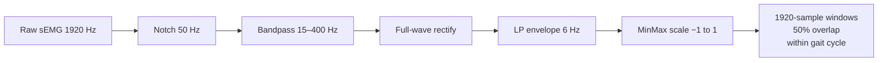
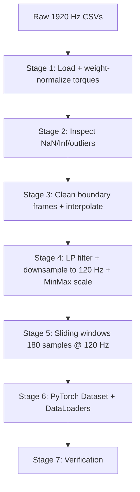

# Unsupervised Gait Anomaly Detection using SIAT-LLMD

This repository contains the official codebase and scientific documentation for an unsupervised, reconstruction-based gait anomaly detection framework using the **SIAT-LLMD** dataset. The system models the normal distribution of healthy human lower-limb motion across two independent modalities and detects deviations from that baseline using reconstruction error.

**Modalities:** sEMG (9 channels) · Kinematics (8 joint angles) · Kinetics (8 joint torques)  
**Models:** SARIMA · LSTM Autoencoder · Transformer Autoencoder  
**Fusion:** Late fusion at the anomaly-score level (both pipelines share an identical output CSV schema)

---

## 📂 Project Architecture

```
├── SIAT_LLMD20230404/            # Raw SIAT-LLMD Dataset (ignored by Git)
│   └── SIAT_LLMD20230404/
│       ├── Sub01/ ... Sub40/     # Aligned CSV Data & Labels per subject
│       │   ├── Data/             # Sub##_[MOV]_Data.csv  (26 columns @ 1920 Hz)
│       │   └── Labels/           # Sub##_[MOV]_Label.csv (Time, Status, Group)
│       └── SubjectInformation.xlsx
│
├── preprocessing/                # Shared Kinematics & Kinetics Preprocessing
│   ├── __init__.py
│   ├── loader.py                 # Metadata loading, CSV parsing, torque normalization
│   ├── inspector.py              # NaN/Inf tracking, IQR outlier detection
│   ├── cleaner.py                # Cycle alignment, cubic spline interpolation
│   ├── conditioner.py            # Butterworth filtering, downsampling, min-max scaling
│   ├── windower.py               # Sliding window segmentation within cycle bounds
│   └── dataset.py                # PyTorch Dataset wrappers and split generators
│
├── semg_pipeline/                # sEMG Modality Pipeline
│   ├── __init__.py               # Public API exports
│   ├── loader.py                 # sEMG column loading + label-convention detection
│   ├── filter.py                 # Notch → Bandpass → Rectify → Envelope chain
│   ├── normalizer.py             # Per-channel MinMax scaler (train-only fit + JSON)
│   ├── windower.py               # 1920-sample windows, 50% overlap, cycle-safe
│   ├── anomaly_scorer.py         # μ+3σ threshold + 12-column output CSV builder
│   ├── evaluator.py              # Recall, F1, RMSE, confusion matrix
│   ├── run_pipeline.py           # Master orchestration script
│   └── models/
│       ├── sarima_model.py       # pmdarima auto_arima per channel
│       ├── lstm_model.py         # PyTorch LSTM Autoencoder per channel
│       └── transformer_model.py  # PyTorch Transformer Autoencoder per channel
│
├── kinetics_pipeline/            # Kinematics + Kinetics Modality Pipeline
│   ├── __init__.py
│   ├── anomaly_scorer.py         # μ+3σ threshold + 12-column output CSV builder
│   ├── evaluator.py              # Recall, F1, RMSE, confusion matrix
│   ├── run_pipeline.py           # Master orchestration script
│   └── models/
│       ├── sarima_model.py       # pmdarima auto_arima per channel
│       ├── lstm_model.py         # PyTorch LSTM Autoencoder per channel
│       └── transformer_model.py  # PyTorch Transformer Autoencoder per channel
│
├── fusion/                       # Multimodal Late Fusion Modality Package
│   └── __init__.py
│
├── notebooks/                    # Experimental / analysis notebooks
│
├── utils/
│   └── synthetic_anomalies.py    # Shared anomaly injection module (both pipelines)
│
├── outputs/                      # Generated at runtime (ignored by Git)
│   ├── semg/                     # sEMG pipeline output CSVs and summaries
│   ├── kinetics/                 # Kinematics/Kinetics pipeline output CSVs and summaries
│   ├── fusion/                   # Late fusion outputs
│   ├── checkpoints/              # Saved model checkpoints and weights
│   ├── figures/                  # Plotted analysis figures
│   └── logs/                     # Script output logs
│
├── config/                       # Pipeline parameters and hyperparameter files
│
├── docs/                         # Scientific & engineering documentation
│   ├── dataset_summary.md        # Conventions, channel names, label codes, file specs
│   ├── preprocessing_notes.md    # Sensor setup, coordinate system, windowing guidelines
│   ├── implementation_plan.md    # Roadmap (Stages 1–7) and pipeline verification
│   └── design_desicions.md       # Decision log tracking parameters and validations
│
├── .gitignore
└── README.md
```

## 📦 Package Responsibilities

* **`preprocessing/`**: Implements the shared joint signal cleaning, filtering, downsampling to 120 Hz, Min-Max scaling, and cyclic window generation for joint angles and joint torques. Reused by both pipelines.
* **`semg_pipeline/`**: Dedicated pipeline for the sEMG modality. Processes raw high-frequency sEMG signals (1920 Hz), trains models (SARIMA, LSTM, Transformer), and scores reconstructions to label anomalies.
* **`kinetics_pipeline/`**: Dedicated pipeline for the Kinematics + Kinetics modality. Utilizes downsampled signals (120 Hz) loaded from the shared `preprocessing` package to train models, score reconstructions, and evaluate anomaly detection performance.
* **`fusion/`**: Combines the output anomaly scores of the sEMG and kinematics+kinetics pipelines in a late-fusion stage to improve final multimodal anomaly detection accuracy.


---

## 📚 Important Research Documentation

Teammates should review these files in `docs/` before making changes:

1. **`docs/design_desicions.md`** — Decision tracking log. Every major pipeline parameter is categorized as *Accepted/Verified* (literature-backed) vs *Engineering Decision* (needs validation). Prevents arbitrary parameter tuning.

2. **`docs/dataset_summary.md`** — Full label convention reference, channel mappings, and gait phase codes. **Read this before touching any loader.** The Status column encodes differently across movement types (see [Label Conventions](#%EF%B8%8F-label-conventions) below).

3. **`docs/preprocessing_notes.md`** — Hardware setup (Vicon/Delsys Trigno), coordinate systems, filtering rationale.

---

## ⚠️ Label Conventions

The `Status` column in label CSVs uses **three different encoding schemes** depending on movement type. Both pipelines handle this automatically.

| Movement type | Movements | Status values | Active condition |
|---|---|---|---|
| Cyclic gait phases | WAK, UPS, DNS | `1.0` – `5.0` (phase codes) | All non-NaN rows |
| Discrete A/R | LLB, LLF, LLS, LUGB, LUGF, KLCL, KLFT, HS, SITDN, STDUP, TPTO, TO | `'A'` / `'R'` strings | `Status == 'A'` only |
| Static | STC | `'R'` only | No active frames |

---

## 🦵 sEMG Pipeline (`semg_pipeline/`)

Processes raw sEMG signals at native **1920 Hz** (no downsampling — required to preserve the 15–400 Hz EMG frequency band). All three models are trained in an autoencoder style: anomaly score = reconstruction MSE.

### Signal Processing Chain



### Models

| Model | Architecture | Notes |
|---|---|---|
| **SARIMA** | `pmdarima.auto_arima` per channel | Trains on ≤5 subjects (slow); documented limitation |
| **LSTM AE** | Encoder LSTM(64) → RepeatVector → Decoder LSTM(64) → Linear | Input: `(1920, 1)` per channel |
| **Transformer AE** | Sinusoidal PE + TransformerEncoder(d=64, heads=4, layers=2) → Linear | Input: `(1920, 1)` per channel |

**Training:** MSE loss · Adam lr=0.001 · 50 epochs · batch 32 · early stopping patience=5 on val loss · seed=42

**Threshold:** `mean(train_errors) + 3 × std(train_errors)` per channel per model

### Subject Split

| Split | Subjects | Role |
|---|---|---|
| Train | Sub01 – Sub30 | Fit scaler + train models + compute thresholds |
| Validation | Sub31 – Sub35 | Early stopping for LSTM & Transformer |
| Test | Sub36 – Sub40 | Score clean + synthetic anomaly windows |

### Synthetic Anomaly Injection (Test Set)

10 anomaly conditions are applied to each clean test window (imported from the shared `utils/synthetic_anomalies.py`):

| Type | Severities | Clinical simulation |
|---|---|---|
| `amplitude_scale` | mild / moderate / severe | Muscle weakness, reduced ROM |
| `time_warp` | mild / moderate / severe | Hemiparetic asymmetric gait |
| `time_shift` | mild / moderate / severe | Neuromuscular activation delay |
| `combined` | moderate (all three) | Compound pathology |

### Output CSV Schema

One CSV per subject × movement × model. **Column names are identical to the kinematics/kinetics pipeline for late fusion.**

```
subject_id, modality, channel_name, movement, window_id,
window_start_time, window_end_time, reconstruction_error,
is_synthetic_anomaly, anomaly_type, predicted_label, model_name
```

- `modality` is always `"sEMG"`
- `is_synthetic_anomaly`: `0` = clean, `1` = injected anomaly
- `predicted_label`: `1` if `reconstruction_error > threshold`, else `0`

---

## 🦴 Kinematics/Kinetics Pipeline (`preprocessing/`)

Processes joint angles and torques at **120 Hz** (downsampled from 1920 Hz). Follows a 7-stage pipeline:



**Window size:** 180 samples = 1.5 s at 120 Hz · **Overlap:** 90 samples (50%)

---

## ⚠️ Synthetic Anomaly Module (`utils/synthetic_anomalies.py`)

Both pipelines import this **same file**. Do not create separate copies — consistency across modalities is required for late fusion to be valid.

```python
from utils.synthetic_anomalies import (
    inject_amplitude_scale,   # Reduced range of motion
    inject_time_warp,         # Asymmetric gait timing
    inject_time_shift,        # Delayed activation
    inject_combined,          # All three combined
    DEFAULT_SEVERITIES,       # {'mild': 0.15, 'moderate': 0.35, 'severe': 0.60}
    ANOMALY_TYPES,            # Canonical anomaly_type strings for output CSV
)
```

---

## 🚀 Getting Started

### 1. Install Dependencies

```bash
pip install numpy pandas scipy torch pmdarima scikit-learn
```

Or use the supplied conda environment:
```bash
conda env create -f SIAT_LLMD20230404/Code/codeV4.2/environments/sEMG_IR.yaml
conda activate sEMG_IR20210903
```

### 2. Run the sEMG Pipeline

```bash
# Smoke-test (2 train subjects, 1 test subject, LSTM only, WAK movement):
python -m semg_pipeline.run_pipeline \
    --base_dir SIAT_LLMD20230404/SIAT_LLMD20230404 \
    --movements WAK --models lstm --dry_run

# Full pipeline — all models, all 16 movements:
python -m semg_pipeline.run_pipeline \
    --base_dir SIAT_LLMD20230404/SIAT_LLMD20230404

# Skip retraining — reload saved weights and re-score:
python -m semg_pipeline.run_pipeline \
    --base_dir SIAT_LLMD20230404/SIAT_LLMD20230404 \
    --skip_training --models lstm transformer

# SARIMA only with reduced subset:
python -m semg_pipeline.run_pipeline \
    --base_dir SIAT_LLMD20230404/SIAT_LLMD20230404 \
    --models sarima --sarima_max_subjects 3
```

### 3. Use the sEMG Pipeline Programmatically

```python
from semg_pipeline import (
    load_semg_trial, build_trial_paths,
    apply_semg_filter_chain,
    fit_scaler, apply_scaler,
    create_semg_windows,
)

# Load one trial (active frames only, label-convention-aware)
data_path, label_path = build_trial_paths(
    "SIAT_LLMD20230404/SIAT_LLMD20230404", "Sub01", "WAK"
)
df = load_semg_trial(data_path, label_path)

# Filter at 1920 Hz
df = apply_semg_filter_chain(df)

# Fit scaler on training data, apply to any split
params = fit_scaler([df])           # pass list of all train trial DFs
df_scaled = apply_scaler(df, params)

# Window: shape (N, 1920, 9)
windows, metadata = create_semg_windows(df_scaled)
```

### 4. Use the Kinematics/Kinetics Pipeline

```python
from preprocessing import get_subject_split_loaders

train_loader, val_loader, test_loader, scaling_params = get_subject_split_loaders(
    base_dir="SIAT_LLMD20230404/SIAT_LLMD20230404",
    movements=["WAK"],
    window_size=180,     # 1.5 s @ 120 Hz
    overlap_size=90,     # 50% overlap
    batch_size=32,
    target_fs=120.0,
)

for batch_x, batch_meta in train_loader:
    # batch_x shape: (32, 180, 16)  — 8 kinematic + 8 kinetic channels
    pass
```

---

## 🔗 Late Fusion

Both pipelines produce output CSVs with identical column schemas. To fuse:

```python
import pandas as pd

semg_df = pd.read_csv("outputs/sEMG/Sub36/Sub36_WAK_LSTM_scores.csv")
kine_df = pd.read_csv("outputs/kinematics/Sub36/Sub36_WAK_LSTM_scores.csv")

# Merge on shared keys — then fuse scores (e.g. max, mean, product rule)
fused = pd.merge(semg_df, kine_df, on=["subject_id", "movement", "window_id"],
                 suffixes=("_semg", "_kine"))
fused["fused_score"] = fused[["reconstruction_error_semg",
                               "reconstruction_error_kine"]].mean(axis=1)
```

---

## 📋 sEMG Channel Reference

| Index | CSV column name | Canonical name (output CSV) |
|---|---|---|
| 17 | `sEMG: tensor fascia lata` | `tensor_fascia_lata` |
| 18 | `sEMG: rectus femoris` | `rectus_femoris` |
| 19 | `sEMG: vastus medialis` | `vastus_medialis` |
| 20 | `sEMG: semimembranosus` | `semimembranosus` |
| 21 | `sEMG: upper tibialis anterior` | `upper_tibialis_anterior` |
| 22 | `sEMG: lower tibialis anterior` | `lower_tibialis_anterior` |
| 23 | `sEMG: lateral gastrocnemius` | `lateral_gastrocnemius` |
| 24 | `sEMG: medial gastrocnemius` | `medial_gastrocnemius` |
| 25 | `sEMG: soleus` | `soleus` |