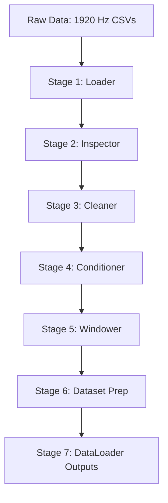

# Unsupervised Gait Anomaly Detection using SIAT-LLMD

This repository contains the official codebase and scientific documentation for the unsupervised, reconstruction-based gait anomaly detection framework using the **SIAT-LLMD** dataset.

The research objective of this project is to learn the normal distribution of healthy human lower-limb kinematics and kinetics, and detect deviations from this healthy baseline using reconstruction error (comparing **SARIMA**, **LSTM**, and **Transformer** autoencoders).

---

## 📂 Project Architecture

```
├── SIAT_LLMD20230404/            # Raw SIAT-LLMD Dataset (ignored by Git)
│   ├── Sub01/ ... Sub40/         # Aligned CSV Data & Labels per subject
│   └── SubjectInformation.xlsx    # Subjects' anatomical parameters (height, weight, age)
├── docs/                         # Scientific & Engineering Documentation
│   ├── dataset_summary.md        # Conventions, channel names, label codes, and file specs
│   ├── preprocessing_notes.md    # Sensor setup, coordinate system, windowing, and scaling guidelines
│   ├── implementation_plan.md    # Roadmap (Stages 1–7) and pipeline verification
│   ├── design_desicions.md       # Decision log tracking parameters and design validations
│   └── literature_matrix.md      # Literature tracking matrix justifying choices for publication
├── preprocessing/                # Clean, modular preprocessing pipeline
│   ├── __init__.py               # Exports loader, cleaner, conditioner, windower, dataset
│   ├── loader.py                 # Metadata loading, CSV parsing, and torque weight normalization
│   ├── inspector.py              # Sanity checks (NaN/Inf tracking) and IQR outlier detection
│   ├── cleaner.py                # Cycle frame alignment and cubic spline interpolation
│   ├── conditioner.py            # Butterworth filtering, downsampling, and min-max scaling
│   ├── windower.py               # Sliding window segmentation restricted within cycle bounds
│   └── dataset.py                # PyTorch Dataset wrappers and subject-wise split generators
├── utils/                        # Shared mathematical utilities
│   └── synthetic_anomalies.py    # Standardized synthetic anomaly injection module
├── config/                       # Pipeline configuration files (future use)
├── models/                       # SARIMA, LSTM, Transformer Autoencoders (future use)
├── evaluation/                   # Evaluator and ROC-AUC curve scripts (future use)
├── .gitignore                    # Ensures heavy datasets are not committed
└── README.md                     # Project overview and research onboarding
```

---

## 📚 Important Research Documentation

Teammates joining this research project should review the following key markdown files in the [docs/](file:///e:/SIAT/docs/) directory to understand the biomechanical and machine learning rationales behind our pipeline design:

1. **[docs/design_desicions.md](file:///e:/SIAT/docs/design_desicions.md) (Decision Tracking Log):**
   * Tracks every major pipeline parameter (e.g. window sizes, Butterworth cutoff frequencies, downsampling rate).
   * Categorizes choices as *Accepted/Verified* (backed by literature) vs *Engineering Decisions* (requiring further empirical validation or search for supporting papers).
   * Crucial for maintaining research integrity and preventing arbitrary parameter tuning.

2. **[docs/literature_matrix.md](file:///e:/SIAT/docs/literature_matrix.md) (Literature Justification Matrix):**
   * Acts as a repository of scientific citations.
   * Maps specific pipeline choices (e.g., $6\text{ Hz}$ kinematics cutoff, torque bodyweight scaling, subject-wise splits) to peer-reviewed gait/biomechanical literature.
   * Crucial for writing the *Methods* section of the final IEEE conference paper.

3. **[docs/dataset_summary.md](file:///e:/SIAT/docs/dataset_summary.md) & [docs/preprocessing_notes.md](file:///e:/SIAT/docs/preprocessing_notes.md) (Dataset Specs):**
   * Explains hardware configurations (Vicon/Delsys), coordinate planes, data channel mappings, and synchronized gait phase label codes.

---

## 🔬 The Preprocessing Pipeline (Stages 1–7)

The `preprocessing` package processes high-frequency synchronized multi-modal data in a clean, unified, and zero-leakage workflow:



### **Stage 1: Dataset Loading (`loader.py`)**
Loads physical subject metadata (e.g. weights) and aligns synchronized kinematic (8 channels of joint angles) and kinetic (8 channels of joint torques) signals.
* **Torque Weight-Normalization:** Normalizes joint torques by each subject's body weight to compute biological joint moments ($N \cdot m / kg$), enabling cross-subject comparisons.

### **Stage 2: Signal Inspection (`inspector.py`)**
Verifies signal integrity (detects missing values/constant signals) and flags transient spikes or motion capture artifacts using Interquartile Range (**IQR**) outlier detection.

### **Stage 3: Data Cleaning (`cleaner.py`)**
* **Cycle Alignment:** Discards initialization and boundary transition frames (where Status is `NaN`) so that training is restricted strictly to continuous cyclic walking.
* **Interpolation:** Fills minor tracking dropouts using cubic spline interpolation.

### **Stage 4: Preprocessing & Conditioning (`conditioner.py`)**
* **Zero-Phase Butterworth Filtering:** Applies bidirectional low-pass filtering to eliminate high-frequency marker jitter and impact noise without introducing temporal phase shifts (Cutoffs: **$6\text{ Hz}$** for kinematics; **$10\text{ Hz}$** for kinetics).
* **Decimation Downsampling:** Downsamples high-frequency synchronized data from **$1920\text{ Hz} \to 120\text{ Hz}$** to make sequence lengths computationally manageable for recurrent and attention models.
* **Scaling:** Applies subject-specific Min-Max scaling to target range **$[-1.0, 1.0]$** to balance joint features.

### **Stage 5: Window Generation (`windower.py`)**
Segments continuous signals into fixed-size overlapping sliding windows (e.g., $1.0\text{ second}$ / $120\text{ frames}$ at $120\text{ Hz}$).
* **Cycle Bound Constraint:** Statically enforces that all samples in a window must belong to the same cyclic `Group` index to prevent cross-stride boundaries from contaminating windows.

### **Stage 6: Dataset Preparation (`dataset.py`)**
Wraps the processed windows into PyTorch `SIATGaitDataset` and outputs standard PyTorch `DataLoaders`.
* **Zero-Leakage Subject Split:** Partitions the cohort subject-wise:
  * **Train:** Subjects 01–30
  * **Validation:** Subjects 31–35
  * **Test:** Subjects 36–40
  * *Train scaling parameters are saved and applied to Validation and Test sets to prevent validation leakage.*

### **Stage 7: Verification**
An automated verification test script (`scratch/test_pipeline.py`) validates the pipeline shape, range boundaries, and split sizes.

---

## ⚠️ Synthetic Anomaly Injection (`utils/synthetic_anomalies.py`)

Because the SIAT-LLMD cohort contains only healthy participants, we simulate realistic gait pathologies mathematically to obtain ground-truth labels for evaluation:

1. **Amplitude Scaling:** Simulates reduced range of motion (e.g. joint stiffness or muscle weakness) by scaling signal deviation down around its mean.
2. **Time Warping:** Simulates temporal asymmetry (e.g., stroke hemiparetic gait) by stretching the first half of a stride and compressing the second half.
3. **Time Shifting:** Simulates delayed muscle activation (neuromuscular latency) by shifting the sequence forward and applying edge-hold padding.

*Both teammates (sEMG pipeline and kinematics/kinetics pipeline) import this shared file to ensure that anomaly definitions, labels (`0` for clean, `1` for anomalous), and severity parameters (`mild=0.15`, `moderate=0.35`, `severe=0.60`) are identical for later multimodal fusion.*

---

## 🚀 Getting Started

### 1. Setup the Environment
Configure the Python environment using the supplied yaml file:
```bash
conda env create -f SIAT_LLMD20230404/Code/codeV4.2/environments/sEMG_IR.yaml
conda activate sEMG_IR20210903
```

### 2. Verify the Pipeline
To verify the entire loading, filtering, and windowing pipeline, run the verification script:
```bash
python .system_generated/../scratch/test_pipeline.py
```
*(The script will verify loaders, min-max ranges, subject-wise splits, and print `Pipeline verification SUCCESS!`)*

### 3. Usage Example
Here is how to load the data loaders in your modeling script:
```python
from preprocessing import get_subject_split_loaders

train_loader, val_loader, test_loader, scaling_params = get_subject_split_loaders(
    base_dir="SIAT_LLMD20230404",
    movements=['WAK'],
    window_size=120,    # 1.0 second window at 120 Hz
    overlap_size=60,    # 50% overlap
    batch_size=32,
    target_fs=120.0
)

for batch_x, batch_meta in train_loader:
    # batch_x shape: (32, 120, 16)
    # batch_meta: dict containing subjects, movements, and gait phases
    pass
```